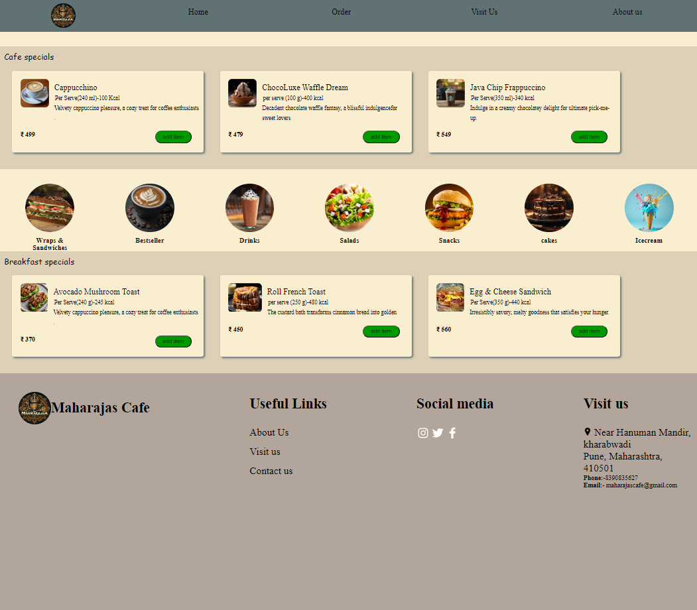
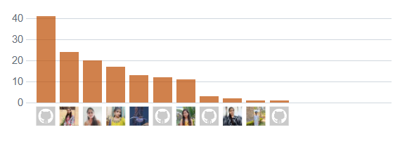

### Maharaja's Cafe
## Project Overview
This project is a responsive website for a cafe. It provides information about the cafe, including its menu, location, hours of operation, and contact details. The website also features a Cafes special menu with online reservation service.



## Features
**Home Page**: Introduction to the cafe with a hero image and welcome message.

**Menu**: Detailed menu with categories for different types of food and beverages.

**Contact**: Contact form and map showing the cafe’s location.

**Responsive Design**: Optimized for both desktop and mobile devices.

## Technologies Used
- HTML5
- CSS3
- Git for version control
- Netlify for website hosting

## Installation
1. Clone the repository:
   ``` bash
   git clone https://github.com/your-username/cafe-website.git cd cafe-website
   
   ``` 
2. Install dependencies:
   ``` bash
   npm install
   ```

3. Start the development server:
   ``` bash
   npm start
   ```

## How to contribute 
Contributions are welcome! Please follow these steps to contribute:

1. Fork the repository.
2. Create a new branch
   ``` bash
   git checkout -b feature-name
   ```
3. Make your changes and commit
   ``` bash
   git commit -m "Description of your feature"
   ```
4. Push to the branch
   ```bash
   git push origin feature-name
   ```
5. Create a pull request.

## Contribution Graph 

   
## Usage
It mentions visiting the site to explore various sections like the menu and reservations. It also notes that future implementations might include an admin panel for updating the menu and managing reservations.

## Contact 
- Email : Maharjascafe@gmail.com
- Project Link :
  - https://main--funny-elf-525eac.netlify.app/
  
  - https://github.com/Samikshanikhare/icp-8.0-html-css-group-project-2


